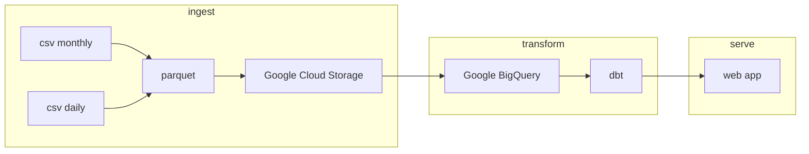

# Fuel Prices QLD project

This project is a simple web app that displays the historical fuel prices in Queensland, Australia.

## Data

Data is sourced from my other project [QLD_fuel_scraping](https://github.com/gsajko/QLD_fuel_scraping)

## Install

### Poetry
First, you need to install `poetry`. For this project, I use version `1.4.0`

https://python-poetry.org/docs/#installation

Remember to add poetry to your path.

`export PATH="/home/[user]/.local/bin:$PATH"`

### Init submodule

`git submodule init`
`git submodule update`

### 

## App Overview

### todo
- [ ] use terraform to create GCP resources
- [ ] dockerize the app

---

- [ ] create config file
- [ ] create dbt models
- [ ] deploy web app

## done
- [x] ingest data from CSV to GCS in parquet format
- [x] create external tables in BigQuery

## next
- [x] ingest data from CSV to GCS in parquet format
    - [ ] upload directly from pandas to GCS
    - [ ] join into one file before uploading? partition it by some value? use DuckDB?
        - compare speeds
        - parquet optimization: avoid many small files
        - could do this with github action in the scraping repo
        - upload in a asynchronous way