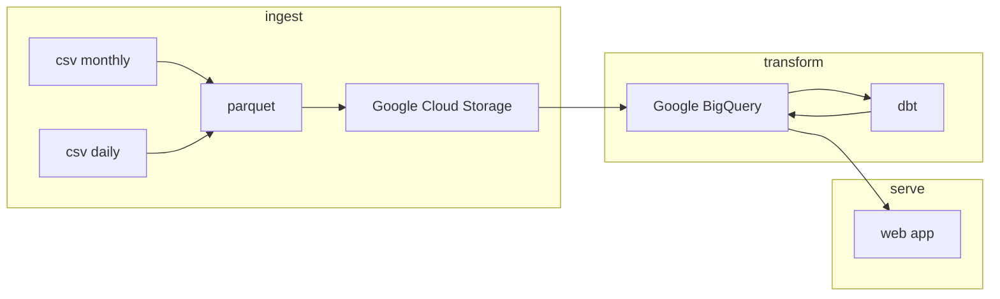

# Fuel Prices QLD project

This project is a simple web app that displays the historical fuel prices in Queensland, Australia.

## Data

Data is sourced from my other project [QLD_fuel_scraping](https://github.com/gsajko/QLD_fuel_scraping)

## Install

### Poetry
First, you need to install `poetry`. For this project, I use version `1.3.2`

https://python-poetry.org/docs/#installation
`curl -sSL https://install.python-poetry.org | python3 - --version 1.3.2`

Remember to add poetry to your path.

`export PATH="/home/[user]/.local/bin:$PATH"`

### installing dagster
There is a problem with installing dagster with poetry because of the `pendulum` package. The solution is to install it with `pip`.

`pip install --no-build-isolation pendulum`.

There could be error about `poetry`, in that case `poetry` needs to be installed first with `pip` as well. (`pip install poetry`)

### Init submodule

???

### install dbt
`export DBT_PROFILES_DIR=/home/sajo/fuel_prices_qld/dbt_fuel/config/`

`export DBT_PROJECT_DIR=/home/sajo/fuel_prices_qld/dbt_fuel/`

## App Overview

### todo
- [ ] create config file
- [ ] make transforms using dbt cloud
- [ ] deploy web app

---
- [ ] use terraform to create GCP resources

## done
- [x] ingest data from CSV to GCS in parquet format
- [x] create external tables in BigQuery

## next
- [x] ingest data from CSV to GCS in parquet format
    - [ ] upload directly from pandas to GCS
    - [ ] join into one file before uploading? partition it by some value? use DuckDB?
        - compare speeds
        - parquet optimization: avoid many small files
        - could do this with github action in the scraping repo
        - upload in a asynchronous way
- [ ] make transforms using dbt core