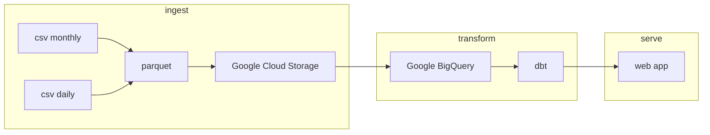

# Fuel Prices QLD project

This project is a simple web app that displays the historical fuel prices in Queensland, Australia.

## Data

Data is sourced from my other project [QLD_fuel_scraping](https://github.com/gsajko/QLD_fuel_scraping)

## Install

### Poetry

First you need to install `poetry`. For this project I use version `1.4.0`

https://python-poetry.org/docs/#installation

Remeber to add poetry to your path.

`export PATH="/home/[user]/.local/bin:$PATH"`

### Init submodule

???

### 

## App overview

### todo
- [ ] ingest data from csv to GCS in parquet format
- [ ] create external tables in BigQuery
- [ ] create dbt models
- [ ] deploy web app

---
- [ ] use terraform to create GCP resources
