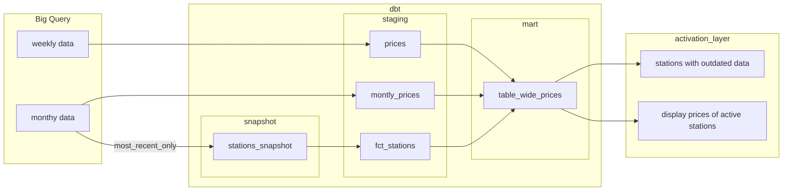

## dbt overview

```mermaid
flowchart LR

subgraph Big Query
m[monthy data]
w[weekly data]
end

m --most_recent_only--> stations_snapshot --> fs
m --> mp
w --> p

subgraph dbt
snapshot
staging
mart
end

subgraph staging
fs[fct_stations]
p[prices]
mp[montly_prices]
end
p & mp --> up

subgraph snapshot
stations_snapshot
end

subgraph mart
up[table_wide_prices]
end

fs --> up
up --> cs
up --> as

subgraph activation_layer
cs[stations with outdated data]
as[display prices of active stations]
end
```